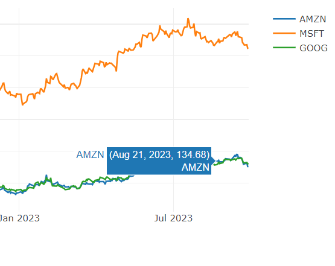
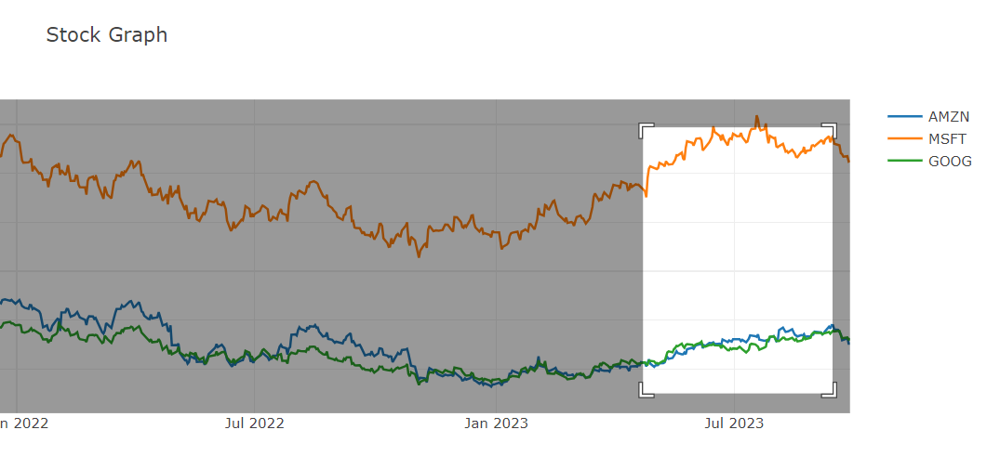

# Stock Price Dashboard 

## Overview
Stock markets have been crucial for global economy, with prices fluctuating daily. Investors rely heavily on predicting future stock prices by analyzing past performance through graphs, making a stock price dashboard essential for anyone studying the market.

## Features
- Visualizing stock price and volume history to deduce value trends.
- Identifying subtle hints in price and volume for insightful analysis.
- Comparing performance of multiple stocks over customizable date ranges.
- Analyzing trends for effective and low-risk market entry points.

## Methodology
The Stock Price Dashboard utilizes Plotly and Dash for the frontend, and Python for the backend, providing a user-friendly and interactive experience. Users can create either Visualization Dashboards for individual stock analysis or Comparison Dashboards for side-by-side stock comparisons.

## Tools
Python, Plotly, Dash, Modern Web Browser.

## Design & Implementation
The dashboard provides real-time stock prices with a selection of 250 companies for analysis and comparison. It offers a range of date selection for historical stock price viewing and comparison.

## Testing
The dashboard underwent rigorous testing for single and comparison visualizations, proving its reliability and efficiency in providing accurate stock data and visual representations for analysis.

### Home Screen
 

## Usage
1. **Visualization Dashboard:**
   - Select company.
     
     
 
   - Choose date range.
     
     
     
   - View visualization.
     
     

2. **Comparison Dashboard:**
   - Select multiple companies.
   - Choose date range.
   - View comparison.
     
     

## Extra Features
- Stock Price, Date, Company Name on Hover

  

- Zoom in feature for better visualization of trends

  
  

## Conclusion
The Stock Price Dashboard is an invaluable tool for investors and individuals interested in the stock market, providing comprehensive data and analysis options for effective decision making and prediction.
